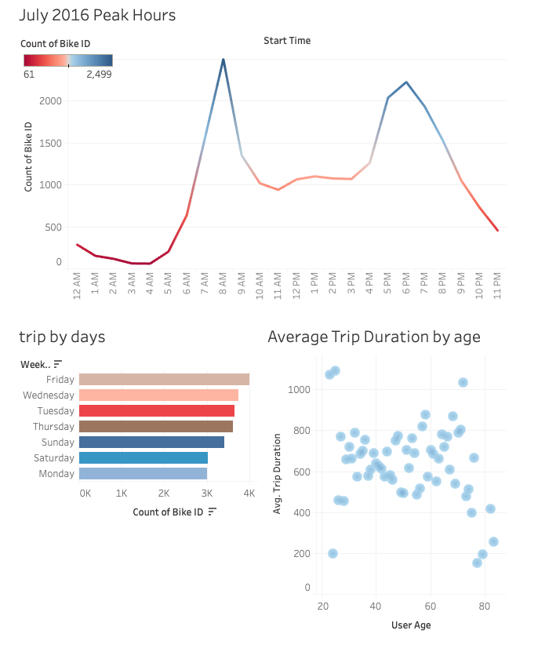
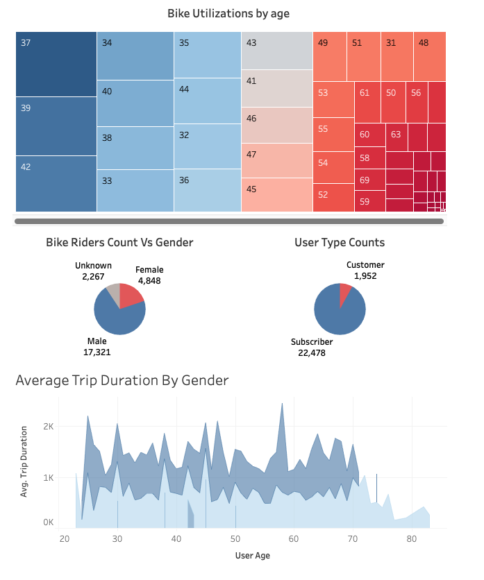

# Tableau_challenge

Analysis:

** A write-up on the trends that were discovered while making the map **

 Geo Locations of start and end stations

As we can see in the geo map , all the markers of the start station and end station. Also on the side we can see the most popular stations for stat and end bike ride. As we hover over the graph we can see the top 5 start stations are Grove St Path, Exchange Place, NewportPath, Hamilton Park and Newport Pkwy. Interestingly these same stations are top 5 chocies to return the bike at the end of the ride too.

Next Dashboard  - Day,hours and age effect on Trip Counts and duration

On this dashboard, we can observe the following:

1. The peak hours to start a bike ride in July 2016 are 7.00 AM - 9.00 AM and 5:00 PM - 7.00 PM.

2. The most and least busy  days in a week are Friday and Monday respectively.

3. Average trip duration are much more for the users within age range 25-65 with someoutliers in the graph.

Next Dashboard - Bike utilization by age, gender, subscribers 

On this particular dashboard the bike utilizations Vs differnt parameters are shown.

1. In the first heat map Most number of bikes are rented by the people of ages ranging between 30 and 40. Also much Less number of bikes are rented by the people of ages 55+.

2. In the first pie chart the data shows the most of the bikes were rented by males as compared to the females, though there were people who chose to not disclose the gender. 

3. In the second pie chart, A big chunk of the bikes were rented by the subscribers who prefer to pay monthly or annualy as opposed to daily customers.

4. Average Trip Duration for females were almost double that males although less number of females rent the bike.

